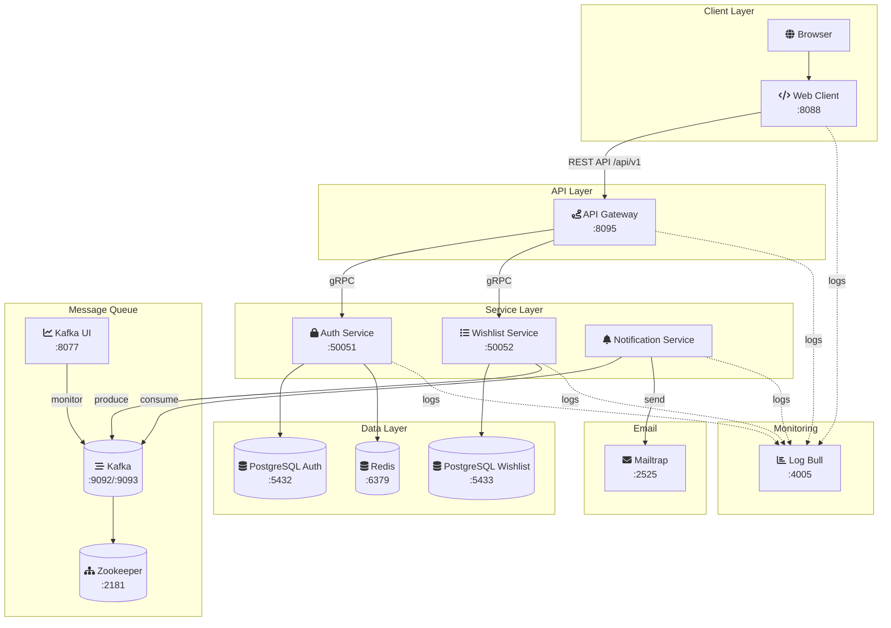

# Сервис вишлистов
### Микросервисное приложение вишлистов. Позволяет создавать вишлисты, наполнять их хотелками, просматривать чужие вишлисты и бронировать в них айтемы.
### Развертывание:
- Копируем `.env.example` и переименовываем в `.env`
- Вызываем
- ```bash
  make wishlist-deploy
  make wishlist-undeploy для выключения
  ```
  Первый запуск может быть очень долгим, последубщие запуски ~40сек в основном из-за zookeeper
- После старта всех контейнеров вызываем
  ```bash
  make postgres-migrate-up
  make postgres-migrate-down для отката
  ```
Поднимутся все сервисы, получить к ним доступ так:
- **webClient**: `http://localhost:8088/` основное UI
- **LogBull**: `http://localhost:4005/` для сквозных логов всех сервисов.
При первом заходе (или сбросе docker volumes) необходимо задать пароль и создать проект.
  uuid проекта запишем в `.env` в `LOGBULL_PROJECT_ID`, чтобы лог заработал,
  необходимо перезапустить контейнер или весь проект `make wishlist-undeploy`, затем `make wishlist-deploy`
- **Kafka_UI**: `http://localhost:8077/`
- Основные ручки сервиса (`api gateway`) можно посмотреть через `swagger`:
  - `http://localhost:8095/swagger/`
  - пример `http://localhost:8095/swagger/api/v1/auth/login`  итд
- БД с хоста доступны по адресам (длф `pgAdmin` например)
  - `localhost:5434` для постгрес сервиса `auth`
  - `localhost:5433` для постгрес сервиса `wishlists` с основной логикой.
    Логин/пароль для строк подключения см. в `.env` `AUTH_DB_USER`, `WISHLIST_DB_USER` ...

Для имитации работы оповещений по smtp предлагаю использовать **mailtrap.io**, внесите в **.env** креды с сервиса
```bash 
SMTP_USER=#User from mailtrap.io`
SMTP_PASSWORD=#Pwd from mailtrap.io
```

Также желательно использовать порт ``2525``, другие непредсказуемо блокируются
``SMTP_PORT=2525``

